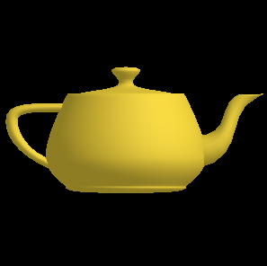
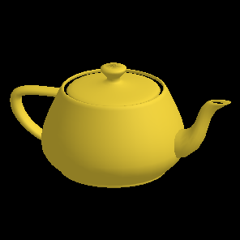
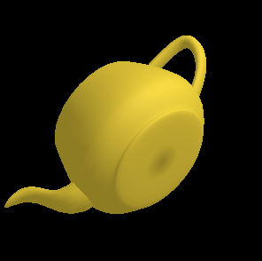
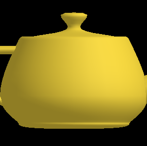
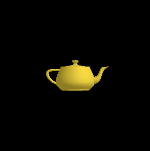
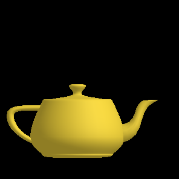
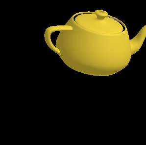

# PyOpenGL

PyOpenGL は、Python で OpenGLUT に相当する機能を利用するものです。

PyOpenGL を利用するには、C言語レベルで、OpenGLUT が利用できる環境を整える必要があります。

その上で、以下のように、PyOpenGL をインストールします。

	pip install PyOpenGL

※ Windows 11 の WSL と WSLg 上で Ubuntu 20.04 が動作している環境では、前述のように pip ではなく、必要に応じて以下のようにインストールします。

	sudo apt install build-essential xorg-dev
    sudo apt install libopengl-dev freeglut3-dev
    sudo apt install python3-opengl

python で以下のプログラムを実行してみます。

```
from OpenGL.GL import *
from OpenGL.GLU import *
from OpenGL.GLUT import *
import sys

m_light0Ambient   = [0.5, 0.5, 0.5, 1.0]	# Light0 color
m_light0Diffuse   = [0.5, 0.5, 0.5, 1.0]
m_light0Specular  = [0.2, 0.2, 0.2, 1.0]
m_light0Direction = [0.0, 0.0, -1.0, 1.0]
m_light0Position  = [1.0, 1.0, 1.0, 0.0]	# Light0 position
m_light0Exponent  = 50.0					# Spot light exponent
m_light0Cutoff    = 45.0					# Spot light cutoff
m_light0Constant  = 1.0						# Constant attenuation
m_light0Linear    = 0.0						# Linear attenuation
m_light0Quadratic = 0.0						# Quadratic attenuation
m_materialAmbient  = [0.5, 0.9, 0.5, 1.0]	# No light material color
m_materialDiffuse  = [0.5, 0.9, 0.5, 1.0]	# Material color
m_materialSpecular = [0.2, 0.2, 0.2, 1.0]	# Specular color
m_materialEmission = [0.0, 0.0, 0.0, 1.0]	# Material light
m_materialShininess  = 10.0					# Ratio of specular
m_fogColor = [0.0, 0.0, 0.0, 1.0]			# Fog color
m_scale = 1.0
m_clipm = 1.0
m_mx = 0.0
m_my = 0.0
m_mz = 0.0
m_mat = [0.0,0.0,0.0,0.0,0.0,0.0,0.0,0.0,0.0,0.0,0.0,0.0,0.0,0.0,0.0,0.0]
m_rot = [1.0,0.0,0.0,0.0,0.0,1.0,0.0,0.0,0.0,0.0,1.0,0.0,0.0,0.0,0.0,1.0]
m_rx_x = 1.0
m_rx_y = 0.0
m_rx_z = 0.0
m_ry_x = 0.0
m_ry_y = 1.0
m_ry_z = 0.0
m_rx = 0.0
m_ry = 0.0
m_mousemode = 0

def	displaymodel():
	size = 1;
	glScalef(1.0/size, 1.0/size, 1.0/size)		# Scale to 1.0
	glTranslatef(0.0, 0.0, 0.0)					# To center of gravity
	glFrontFace(GL_CW)							# CCW is default
	mglColor = [0.8, 0.7, 0.2, 1.0]
	glMaterialfv(GL_FRONT, GL_AMBIENT, mglColor)	# Set material color
	glMaterialfv(GL_FRONT, GL_DIFFUSE, mglColor)
	glPushMatrix()
	glTranslated(0.0, 0.0, 0.0)
	glutSolidTeapot(size)
	glPopMatrix()

def	gl_display():
	global m_light0Exponent			# Spot light exponent
	global m_light0Cutoff			# Spot light cutoff
	global m_light0Constant			# Constant attenuation
	global m_light0Linear			# Linear attenuation
	global m_light0Quadratic		# Quadratic attenuation
	global m_materialShininess
	global m_mousemode				# Mouse mode 0:none 1:rotate 2:move 3:zoom
	global m_mousex					# Mouse mode point x
	global m_mousey					# Mouse mode point y
	global m_cx, m_cy				# Frame size
	global m_scale					# Scale parameter
	global m_clipx, m_clipy			# Clip factor
	global m_clipm					# Clip area
	global m_mx, m_my, m_mz			# Move vector
	global m_rx, m_ry				# Rotation angle
	global m_rx_x, m_rx_y, m_rx_z	# Rotation Vector for x
	global m_ry_x, m_ry_y, m_ry_z	# Rotation Vector for y

	glClearColor(0.0, 0.0, 0.0, 1.0)				# Specify black as clear color
	glEnable(GL_DEPTH_TEST)							# Enable depth test
	glMatrixMode(GL_MODELVIEW)						# For model view transform
	glLoadIdentity()								# Load unit matrix
	glLightfv(GL_LIGHT0, GL_AMBIENT,  m_light0Ambient)		# Set light0
	glLightfv(GL_LIGHT0, GL_DIFFUSE,  m_light0Diffuse)
	glLightfv(GL_LIGHT0, GL_SPECULAR, m_light0Specular)
	glLightfv(GL_LIGHT0, GL_POSITION, m_light0Position)		# Position light 0
	glLightModeli(GL_LIGHT_MODEL_TWO_SIDE, 0)		# Set light model
	glEnable(GL_LIGHTING)							# On light
	glEnable(GL_LIGHT0)								# On light 0
	glTranslatef(m_mx/m_clipm, m_my/m_clipm, 0.0)	# To center of gravity
	glMultMatrixf(m_rot)							# Pre rotation
	glRotatef(m_rx, m_rx_x, m_rx_y, m_rx_z)			# Rotate x
	glRotatef(m_ry, m_ry_x, m_ry_y, m_ry_z)			# Rotate y
	mat = glGetFloatv(GL_MODELVIEW_MATRIX)			# Save rotation matrix
	for i in range(4):
		m_mat[i+0]  = mat[0][i]
		m_mat[i+4]  = mat[1][i]
		m_mat[i+8]  = mat[2][i]
		m_mat[i+12] = mat[3][i]
	glScalef(m_scale, m_scale, m_scale)				# Scale
	glClear(GL_COLOR_BUFFER_BIT | GL_DEPTH_BUFFER_BIT)	# Clear view, depth buffer
	glShadeModel(GL_SMOOTH)							# Smooth shading
	glPolygonMode(GL_FRONT, GL_FILL)				# Draw polygon mode fill
	glEnable(GL_NORMALIZE)	# Auto normalize normal, need normalize for scale
	glCullFace(GL_BACK)								# Cull back face
	glEnable(GL_CULL_FACE)							# Enaable culling
	glFrontFace(GL_CCW)								# CCW is default
	glMaterialfv(GL_FRONT, GL_AMBIENT,   m_materialAmbient)	# Set bi-directional material color
	glMaterialfv(GL_FRONT, GL_DIFFUSE,   m_materialDiffuse)
	glMaterialfv(GL_FRONT, GL_SPECULAR,  m_materialSpecular)
	glMaterialf (GL_FRONT, GL_SHININESS, m_materialShininess)
	glLoadName(-1)									# Invalid atom index
	displaymodel()
	glFlush()
	glutSwapBuffers()

def	gl_reshape(w, h):
	global  m_cx, m_cy              # Frame size
	global  m_clipx, m_clipy        # Clip factor
	global  m_clipm                 # Clip area
	global  m_mx, m_my, m_mz        # Move vector

	clipm = m_clipm
	m_cx = w
	m_cy = h
	glViewport(0, 0, m_cx, m_cy)
	if(m_cx > m_cy) :							# Aspect ratio
		m_clipx = m_cx / m_cy
		m_clipy = 1.0
		m_clipm = m_cy / 2.0
	else :
		m_clipx = 1.0
		m_clipy = m_cy / m_cx
		m_clipm = m_cx / 2.0
	m_mx = m_mx * m_clipm / clipm				# Adjust aspect ratio
	m_my = m_my * m_clipm / clipm
	m_mz = m_mz * m_clipm / clipm
	glMatrixMode(GL_PROJECTION)					# Select projection matrix
	glLoadIdentity()							# Clear projection matrix
	glOrtho(-m_clipx, m_clipx, -m_clipy, m_clipy, -20.0, 20.0)	# View area

def	gl_mouseend(x, y):
	global m_mousemode
	global m_rx, m_ry				# Rotation angle
	global m_rx_x, m_rx_y, m_rx_z	# Rotation Vector for x
	global m_ry_x, m_ry_y, m_ry_z	# Rotation Vector for y

	m_mousemode = 0
	det = m_mat[0] * m_mat[5] * m_mat[10] + m_mat[1] * m_mat[6] * m_mat[8] + m_mat[2] * m_mat[4] * m_mat[9] - m_mat[2] * m_mat[5] * m_mat[8] - m_mat[1] * m_mat[4] * m_mat[10] - m_mat[0] * m_mat[6] * m_mat[9]		# Matrix determinant
	if -1e-30 < det and det < 1e-30 :
		return
	m_rot[0]  = m_mat[0]					# Pre rotation matrix
	m_rot[1]  = m_mat[1]
	m_rot[2]  = m_mat[2]
	m_rot[3]  = 0.0
	m_rot[4]  = m_mat[4]
	m_rot[5]  = m_mat[5]
	m_rot[6]  = m_mat[6]
	m_rot[7]  = 0.0
	m_rot[8]  = m_mat[8]
	m_rot[9]  = m_mat[9]
	m_rot[10] = m_mat[10]
	m_rot[11] = 0.0
	m_rot[12] = 0.0
	m_rot[13] = 0.0
	m_rot[14] = 0.0
	m_rot[15] = 1.0
	m_rx = 0.0								# Initialize rotation angle
	m_ry = 0.0
	m_rx_x = (m_mat[5] * m_mat[10] - m_mat[6] * m_mat[9])  / det	# New rotation vector for screen X
	m_rx_y = (m_mat[2] * m_mat[9]  - m_mat[1] * m_mat[10]) / det
	m_rx_z = (m_mat[1] * m_mat[6]  - m_mat[2] * m_mat[5])  / det
	m_ry_x = (m_mat[6] * m_mat[8]  - m_mat[4] * m_mat[10]) / det	# New rotation vector for screen Y
	m_ry_y = (m_mat[0] * m_mat[10] - m_mat[2] * m_mat[8])  / det
	m_ry_z = (m_mat[2] * m_mat[4]  - m_mat[0] * m_mat[6])  / det

def	gl_motion(x, y):
	global m_mousemode
	global m_mousex
	global m_mousey
	global m_rx, m_ry
	global m_mx, m_my
	global m_scale

	if m_mousemode == 1 :				# Rotate mode
		rx = x - m_mousex
		ry = y - m_mousey
		m_rx += ry / 2.5
		m_ry += rx / 2.5
		if m_rx <   0.0 :
			m_rx += 360.0
		if m_rx > 720.0 :
			m_rx -= 360.0
		if m_ry <   0.0 :
			m_ry += 360.0
		if m_ry > 720.0 :
			m_ry -= 360.0
		m_mousex = x
		m_mousey = y
	if m_mousemode == 2 :				# Move mode
		rx = x - m_mousex
		ry = y - m_mousey
		m_mx += rx
		m_my -= ry
		m_mousex = x
		m_mousey = y
	if m_mousemode == 3 :				# Zoom mode
		ry = y - m_mousey
		m_scale -= ry / 200.0
		if m_scale < 0.0 :
			m_scale = 0.0
		m_mousex = x
		m_mousey = y

def	gl_mouse(button, state, x, y):
	global m_mousemode
	global m_mousex
	global m_mousey

	m_mousex = x
	m_mousey = y
	if button == GLUT_LEFT_BUTTON :
		if state == GLUT_DOWN :
			m_mousemode = 1				# Rotate mode
		elif state == GLUT_UP :
			gl_mouseend(x, y)
	if button == GLUT_MIDDLE_BUTTON :
		if state == GLUT_DOWN :
			m_mousemode = 3				# Zoom mode
		elif state == GLUT_UP :
			gl_mouseend(x, y)
	if button == GLUT_RIGHT_BUTTON :
		if state == GLUT_DOWN :
			m_mousemode = 2				# Move mode
		elif state == GLUT_UP :
			gl_mouseend(x, y)

def	gl_keyboard(key, x, y):
	if key == b'\x1b' :				# ESC key
		os._exit(os.EX_OK)

def	gl_idle():
	glutPostRedisplay()

def	gl_init():
	glutInit(sys.argv)
	glutInitDisplayMode(GLUT_RGB | GLUT_DOUBLE | GLUT_DEPTH)
	glutInitWindowSize(640, 360)		# window size
	glutCreateWindow(b"PyOpenGL")		# show window
	glutDisplayFunc(gl_display)			# draw callback function
	glutReshapeFunc(gl_reshape)			# resize callback function
	glutIdleFunc(gl_idle)
	#glutKeyboardFunc(gl_keyboard)
	glutMouseFunc(gl_mouse);
	glutMotionFunc(gl_motion);
	glutMainLoop()

if __name__ == '__main__':
	gl_init()
```

このプログラムは、新たにウィンドウを作成し、ティーポットを三次元表示します。


左ボタンのマウス操作により、回転させることができます。
 

中央ボタンのマウス操作により、ズームさせることができます。
 

右ボタンのマウス操作により、移動させることができます。
 
